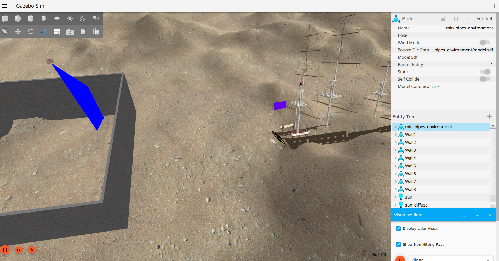

# BlueRov2 exercise for the ROS2 course 

The goal of this exercise is to provide a more realistic scenario of using ROS with underwater vehicles. We are going to simulate the BlueROV2 in a Gazebo environment and control it using ROS. The BlueROV2 is also equipped with a depth sensor. The depth sensor is used to measure the depth of the BlueROV2.

The goal is to subscribe to the sonar data and calculate the height of the walls. If we have time experiment with the different modes of operation of the bluerov and the truster commands to maintain the same depth.




## Summary
- [Sostware requirements](https://github.com/vilmamuco/bluerov2_exercise#sostware-requirements)
- [Installation](https://github.com/vilmamuco/bluerov2_exercise#installation)
- [Run it with docker](https://github.com/vilmamuco/bluerov2_exercise#how-to-run-the-package-using-docker)
- [Run locally](https://github.com/vilmamuco/bluerov2_exercise#run-it-locally)
- [Acknowledgements](https://github.com/vilmamuco/bluerov2_exercise#acknowledgements)

## Sostware requirements

- ubuntu 22.04
- Docker
- Git

## Installation

It is recommended to use the docker installation method described in the next section. If however you want to install the programs directly on your computer, then follow these instructions:

1. Install S.I.T.L. (Software In The Loop). This is a simulatator for running ArduSub. Follow the instructions in the following [link](https://ardupilot.org/dev/docs/building-setup-linux.html#building-setup-linux)

     If you want to use MAC, follow [this instruction](https://ardupilot.org/dev/docs/building-setup-mac.html)

2. Install ROS 2 Iron. Follow the [official instructions](https://docs.ros.org/en/iron/Installation/Ubuntu-Install-Debians.html) on the documentation page.

3. Install Gazebo Garden. Follow the [official instructions](https://gazebosim.org/docs/garden/install_ubuntu) for installing Gazebo Garden.

4. Install mavros2. Follow the instructions in the following [link](https://docs.px4.io/main/en/ros/mavros_installation.html) (Binary Installation is perfectly fine).

5. Install ardupilot_gazebo. Follow the instructions in the following [link](https://github.com/ArduPilot/ardupilot_gazebo/)

## How to run the package using Docker

1. Clone the repository
   ```Bash
   git clone https://github.com/vilmamuco/bluerov2_exercise.git
   cd bluerov2_exercise/src/bluerov2_agent/
   ```

2. Create docker network:

    ```Bash
    sudo docker network create ros_net
    ```

3. Run the following command in the bluerov2_agent directory or skp to step 5 to use the docker image directly.

   ```Bash
   docker build --build-arg UID=$(id -u) --build-arg GID=$(id -g) -t bluerov_image .
   ```
4. Open a new terminal and run the following command
   If you are using an nvidia GPU run the following command:

   ```Bash
   docker run \
       --name=ros2_ws\
       -it --rm \
       -v /tmp/.X11-unix:/tmp/.X11-unix \
       -v /mnt/wslg:/mnt/wslg \
       -e DISPLAY \
       -e WAYLAND_DISPLAY \
       -e NO_AT_BRIDGE=1 \
       -v /run/user/1000/at-spi/bus_0:/run/user/1000/at-spi/bus_0 \
       -e XDG_RUNTIME_DIR \
       -e PULSE_SERVER \
       -v $(pwd):/home/ubuntu/bluerov2_exercise \
       --gpus all \
       bluerov_image bash
   ```
       
   If using **AMD GPU** replace the `--gpus all` flag with this `--device=/dev/dri`:

   ```Bash
   docker run \
       --name=ros2_ws\
       -it --rm \
       -v /tmp/.X11-unix:/tmp/.X11-unix \
       -v /mnt/wslg:/mnt/wslg \
       -e DISPLAY \
       -e WAYLAND_DISPLAY \
       -e NO_AT_BRIDGE=1 \
       -v /run/user/1000/at-spi/bus_0:/run/user/1000/at-spi/bus_0 \
       -e XDG_RUNTIME_DIR \
       -e PULSE_SERVER \
       -v $(pwd):/home/ubuntu/bluerov2_exercise \
       --device=/dev/dri \
       bluerov_image bash
   ```
5. Run with the docker image directly
    If you a NVIDIA GPU:
    ```Bash
    xhost +local:root
    sudo docker run -it --rm --name ignition --net ros_net -e DISPLAY=$DISPLAY -e NO_AT_BRIDGE=1 -v /run/user/1000/at-spi/bus_0:/run/user/1000/at-spi/bus_0  -v /tmp/.X11-unix:/tmp/.X11-unix:ro --gpus all ghcr.io/remaro-network/tudelft_hackathon:nvidia bash
    ```

    If you have an AMD GPU:
    ```Bash
    xhost +local:root ;
    sudo docker run -it --rm --name ignition --net ros_net -e DISPLAY=$DISPLAY -v /tmp/.X11-unix:/tmp/.X11-unix:ro --device=/dev/dri --group-add video  ghcr.io/remaro-network/tudelft_hackathon:non-nvidia  bash
    ```

    If you have an Intel GPU:
    ```Bash
    xhost +local:root ;
    sudo docker run -it --rm --name ignition --net ros_net -e DISPLAY=$DISPLAY -v /tmp/.X11-unix:/tmp/.X11-unix:ro --device=/dev/dri:/dev/dri  ghcr.io/remaro-network/tudelft_hackathon:non-nvidia bash
    ```


### Running the exercise inside the Docker container

Once the container is running, you will need to run four components inside this single container: Gazebo, ArduSub, Mavros and the ROS2 node controlling the robot.
We are going to use 2 terminals to run everything, using a launch file.


1. Keep the terminal running the docker container open, and execute these commands within to run ardusub SITL:
    ```Bash
    cd /ardupilot
    ./Tools/autotest/sim_vehicle.py -L RATBeach -v ArduSub --model=JSON --out=udp:0.0.0.0:14551  --console
    ```
2. Attach a second shell to the container

   Open a new terminal window and start a new shell inside the same docker container:
   ```
   docker exec -it bluerov_image bash
   ```
3. Run the BlueROV2, ArduSub and Mavros2
   In the new shell, run the prepared launch file:
   ```
   cd /home/ubuntu/bluerov2_exercise/
   source /opt/ros/iron/setup.bash
   source install/setup.bash
   colcon build --symlink-install --packages-select bluerov2_agent
   ros2 launch bluerov2_agent bluerov_bringup.launch.py simulation:=true ardusub:=false mavros_url:='udp://127.0.0.1:14551'
   ```

## Run it locally

1. Create new workspace:
    ```Bash
    mkdir -p ~/bluerov2_exercise/src
    cd ~/bluerov2_exercise/
    ```

2. Clone repos:
    ```Bash
    git clone https://github.com/vilmamuco/bluerov2_exercise.git
    vcs import src < ./src/bluerov2.rosinstall --recursive
    ```

3. Add required paths:
    ```Bash
    echo 'export GZ_SIM_RESOURCE_PATH=$HOME/bluerov2_exercise/src/bluerov2_ignition/models:$HOME/bluerov2_exercise/src/bluerov2_ignition/worlds:${GZ_SIM_RESOURCE_PATH}' >> ~/.bashrc

    echo 'export GZ_SIM_RESOURCE_PATH=$HOME/bluerov2_exercise/src/remaro_worlds/models:$HOME/bluerov2_exercise/src/remaro_worlds/worlds:${GZ_SIM_RESOURCE_PATH}' >> ~/.bashrc
    ```

4. Before building the `ros_gz` package (one of the dependencies), you need to export the gazebo version:

    ```Bash
    export GZ_VERSION="garden"
    ```
5. You can also add this to your `~/.bashrc` to make this process easier.

    Install deps:
    ```Bash
    source /opt/ros/iron/setup.bash
    cd ~/bluerov2_exercise/
    rosdep install --from-paths src --ignore-src -r -y
    ```

6. Build project:
    ```Bash
    cd ~/bluerov2_exercise/
    colcon build --symlink-install
    ```

7. Before running anything you need to source the workspace. With this command:

    ```Bash
    source ~/bluerov2_exercise/install/setup.bash
    ```

    Or you can add that to the ~/.bashrc file to prevent needing to source everytime.

    ```Bash
    echo "source ~/bluerov2_exercise/install/setup.bash" >> ~/.bashrc
    ```
    Don't forget to re-open your terminal after altering the `~/.bashrc` file.

8. In one terminal run ardusub SITL:
    ```Bash
    ./Tools/autotest/sim_vehicle.py -L RATBeach -v ArduSub --model=JSON --out=udp:0.0.0.0:14551  --console
    ```

9. In another terminal run the simulation + mavros + agent:
    ```Bash
    ros2 launch bluerov2_agent bluerov_bringup.launch.py simulation:=true ardusub:=false mavros_url:='udp://127.0.0.1:14551'
    ```

## Acknowledgements

This repository is a simplified version of the REMARO Summer School Delft 2022 - Underwater robotics hackathon. For more info, please visit: <a href="https://github.com/remaro-network/tudelft_hackathon.git"> remaro-network/tudelft_hackathon